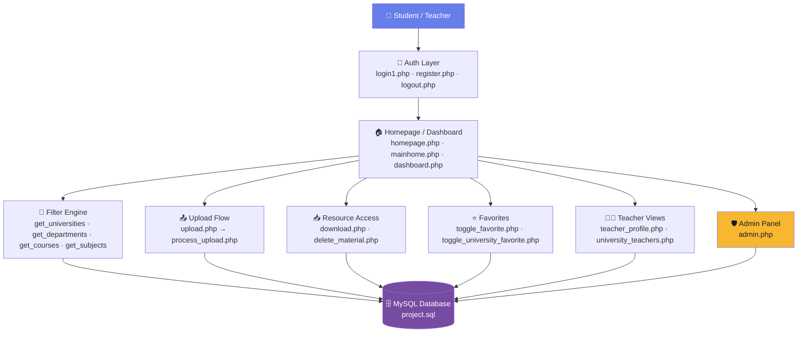
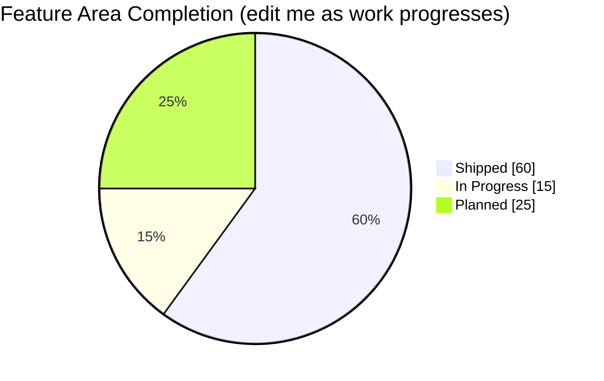

<div align="center">


<a href="https://github.com/Crusty-chirayu/EDU-SHARE-A-Targeted-Knowledge-Exchange-Platform">
  
</a>

<br/>


</div>

<br/>

## 📖 About The Project

**EDU-SHARE** is a web-based academic resource sharing platform designed to connect students and teachers **across different universities and colleges**. It gives users a structured, secure environment to upload, discover, and download study materials — notes, papers, and academic resources — without being boxed in by institutional walls.

Materials are organized in a clean hierarchy — **University → Department → Course → Subject** — so finding relevant content stays fast and intuitive no matter how large the archive grows. At its core, EDU-SHARE is a bet on open, collaborative learning: knowledge shouldn't stop at a campus gate.

<br/>

## 🧭 Table of Contents

- [About The Project](#-about-the-project)
- [Features](#-features)
- [Tech Stack](#-tech-stack)
- [System Architecture](#-system-architecture)
- [Project Status & Roadmap](#-project-status--roadmap)
- [Getting Started](#-getting-started)
- [Project Structure](#-project-structure)
- [Contributors](#-contributors)
- [Contributing](#-contributing)
- [License](#-license)

<br/>

## ✨ Features

<table>
<tr>
<td width="50%" valign="top">

**🔐 Accounts & Access**
- Secure registration & login (`register.php`, `login1.php`)
- Session-based auth with clean logout flow
- Dedicated admin panel for platform oversight
- Teacher profile pages, separate from student accounts

**📚 Resource Management**
- Upload notes, papers & academic resources
- Structured storage validated server-side
- One-click download of shared materials
- Delete/manage previously uploaded material

</td>
<td width="50%" valign="top">

**🔎 Discovery & Organization**
- Cascading filters: University → Department → Course → Subject
- Dynamic AJAX-driven dropdowns for fast browsing
- Browse teachers by university (`university_teachers.php`)

**⭐ Personalization**
- Favorite individual materials for quick access later
- Favorite entire universities to follow their content
- Personal dashboard summarizing your activity

</td>
</tr>
</table>

<br/>

## 🛠 Tech Stack

<div align="center">


</div>

| Layer | Choice | Why |
|---|---|---|
| Frontend | HTML, CSS, JavaScript | Lightweight, zero build step, fast to iterate on |
| Backend | PHP | Simple deployment, tight MySQL integration |
| Database | MySQL | Relational structure fits University/Dept/Course/Subject hierarchy well |
| Security | Sessions + prepared statements | Session-based auth, SQL-injection-safe queries |

<br/>

## 🏗 System Architecture



<br/>

## 📊 Project Status & Roadmap

> Snapshot as of the handoff to full-stack collaboration — update the checkmarks as work lands.



### ✅ Shipped (built by [Rishav](https://github.com/rishav-84ya))
- [x] Auth: register, login, logout, sessions
- [x] Upload / download / delete flow for materials
- [x] University → Department → Course → Subject filter chain
- [x] Favorites for materials & universities
- [x] Admin panel, dashboard, teacher profile pages
- [x] Core MySQL schema (`project.sql`)

### 🚧 In Progress
- [ ] UI/UX overhaul — modern, consistent design system
- [ ] Input validation & error-handling pass across all PHP endpoints
- [ ] Responsive layout for mobile devices

### 🗺 Planned / Future Improvements
- [ ] Migrate raw SQL to prepared statements everywhere (security hardening pass)
- [ ] File preview before download (PDF/image inline viewer)
- [ ] Search bar with full-text search across materials
- [ ] Rating & review system for shared resources
- [ ] Email verification & password reset flow
- [ ] Notifications for new uploads in favorited universities
- [ ] REST API layer for a future mobile app
- [ ] Migrate to a PHP framework (Laravel) for maintainability
- [ ] Docker setup for one-command local environment
- [ ] Automated tests (PHPUnit) + CI pipeline

<sub>💡 This section is meant to evolve — check items off as they ship and add new ones as scope grows.</sub>

<br/>

## 🚀 Getting Started

### Prerequisites
- PHP 7.4+ with a local server (XAMPP / WAMP / MAMP, or built-in `php -S`)
- MySQL 5.7+ / MariaDB
- A browser

### Installation

```bash
# 1. Clone the repo
git clone https://github.com/Crusty-chirayu/EDU-SHARE-A-Targeted-Knowledge-Exchange-Platform.git
cd EDU-SHARE-A-Targeted-Knowledge-Exchange-Platform

# 2. Import the database schema
mysql -u root -p < project.sql

# 3. Configure your database credentials
# open db_connect.php and set host / username / password / db name

# 4. Serve the app
php -S localhost:8000
```

Then open `http://localhost:8000/homepage.php` in your browser. 🎉

<br/>

## 📁 Project Structure

```
EDU-SHARE/
├── admin.php                      # Admin panel
├── dashboard.php                  # User dashboard
├── db_connect.php                 # MySQL connection config
├── delete_material.php            # Remove uploaded material
├── download.php                   # Download handler
├── favorites.php                  # Favorited materials view
├── get_courses.php                # AJAX: courses by department
├── get_departments.php            # AJAX: departments by university
├── get_subjects.php               # AJAX: subjects by course
├── get_universities.php           # AJAX: university list
├── homepage.php / mainhome.php    # Landing / main views
├── lib.php                        # Shared helper functions
├── login1.php / register.php      # Auth
├── logout.php                     # Session termination
├── process_upload.php             # Upload handler
├── project.sql                    # Database schema
├── teacher_profile.php            # Teacher profile page
├── toggle_favorite.php            # Favorite/unfavorite material
├── toggle_university_favorite.php # Favorite/unfavorite university
├── university_teachers.php        # Teachers by university
└── upload.php                     # Upload form
```

<br/>

## 👥 Contributors

<div align="center">

<table>
<tr>
<td align="center" width="50%">
<a href="https://github.com/rishav-84ya">

<br /><sub><b>Rishav Chaurasiya</b></sub>
</a>
<br/>
<sub>🏗️ Original Creator & Backend Architect</sub>
<br/>
<sub>Designed and built EDU-SHARE from the ground up — auth, resource pipeline, filtering system, and database schema.</sub>
<br/><br/>
<a href="https://github.com/rishav-84ya"></a>
</td>
<td align="center" width="50%">
<a href="https://github.com/Crusty-chirayu">

<br /><sub><b>Chirayu</b></sub>
</a>
<br/>
<sub>💻 Full-Stack Developer</sub>
<br/>
<sub>Joining the project to drive full-stack development going forward — UI/UX, feature builds, hardening, and everything in between.</sub>
<br/><br/>
<a href="https://github.com/Crusty-chirayu"></a>
</td>
</tr>
</table>

</div>

<br/>

## 🤝 Contributing

Contributions are what make open academic tooling like this thrive. To propose a change:

1. Fork the repo
2. Create your feature branch (`git checkout -b feature/amazing-feature`)
3. Commit your changes (`git commit -m 'Add amazing feature'`)
4. Push to the branch (`git push origin feature/amazing-feature`)
5. Open a Pull Request

Please open an issue first for larger changes so we can discuss direction before you sink time into it.

<br/>

## 📄 License

Distributed under the MIT License. See `LICENSE` for details.

<br/>

<div align="center">


**⭐ Star this repo if EDU-SHARE is useful to you — it helps other students find it too.**
</div>
